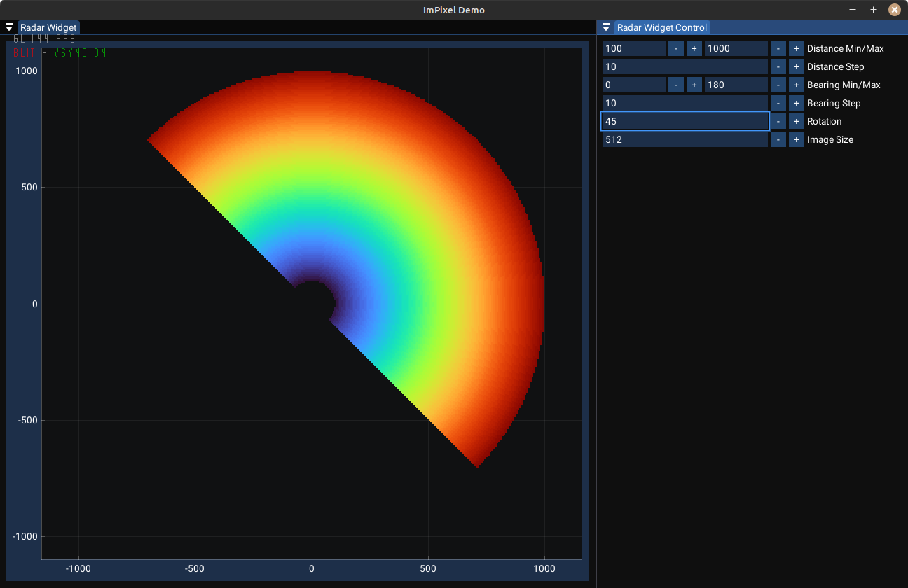

# ImPixel Demo

This a demo project to demonstrate [ImPixelWidgets](https://github.com/gorbatschow/ImPixelWidgets) library.

In two words - this is an implementation of polar grid indicator which often used in radar/sonar displays.

